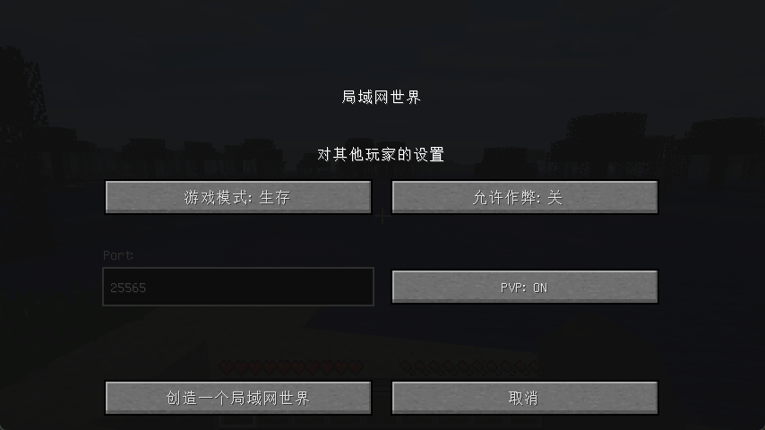

# Multiplayer164 - 局域网联机增强模组

Multiplayer164 是一个专为 Minecraft 1.6.4 版本设计的 Forge 模组，旨在优化和增强原版的局域网联机体验。

本模组允许您在开放局域网时指定固定的端口号，控制 PVP 开关，指定游戏模式和是否允许作弊，并且会自动保存设置项。

保存的设置位于配置文件 `游戏目录/config/Multiplayer164.cfg`

---

powered by Gemini
